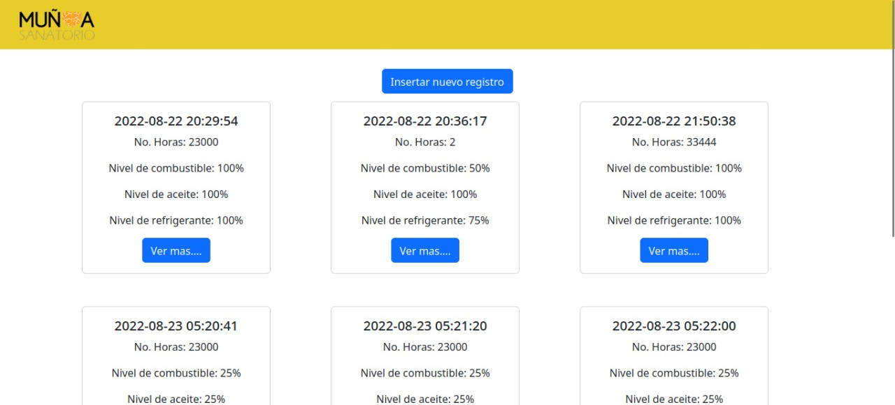

# Módulo Web de Revisión de Equipo Industrial

Este proyecto consiste en un módulo desarrollado con PHP y el framework Laravel, diseñado para la digitalización de checklist de revisión en una planta de emergencia. Su objetivo principal es modernizar y mejorar el proceso de toma de registros en papel utilizado para el chequeo de equipos industriales.

## Descripción

El Módulo Web de Revisión de Equipo Industrial aborda este problema al ofrecer una solución digital que permite a los operarios y técnicos realizar checklists de manera eficiente y precisa. Algunas de las características del módulo incluyen:

- Captura de datos en tiempo real y almacenamiento seguro en una base de datos.
- Generación de informes para identificar posibles fallas. 

La modernización de este proceso no solo reduce el riesgo de errores humanos y pérdida de datos, sino que también mejora la eficiencia general de las operaciones. 

